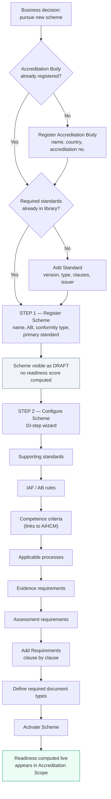
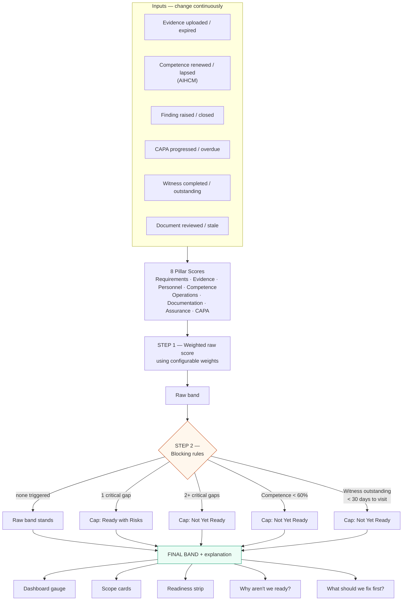
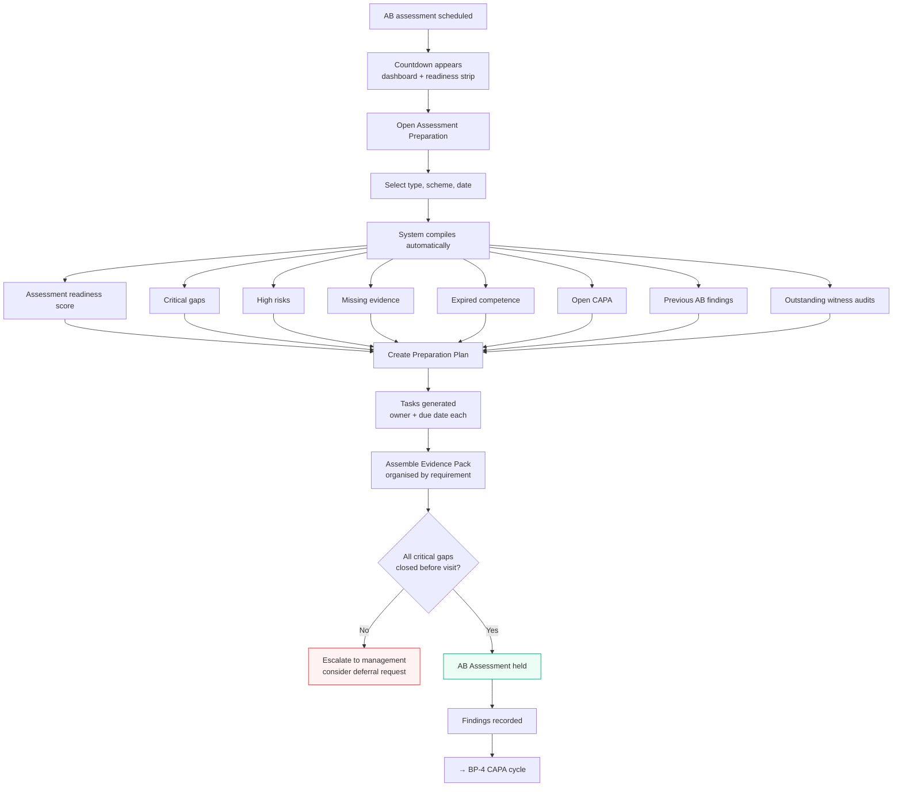
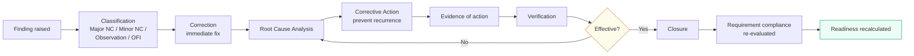
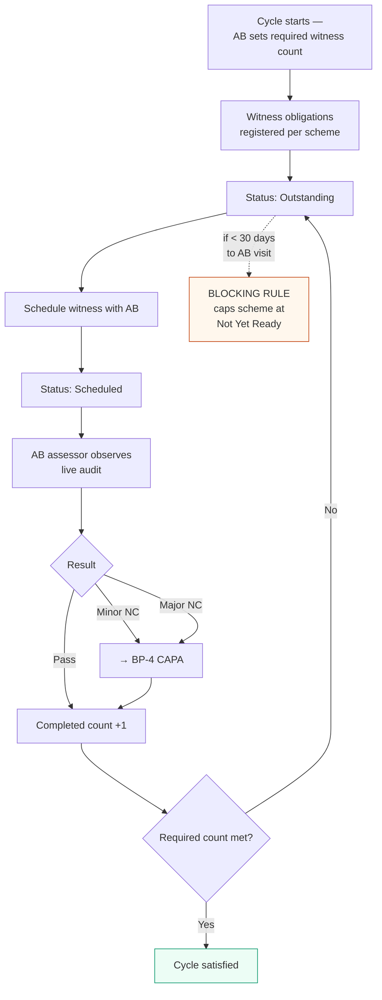
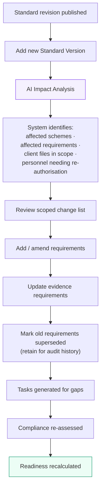
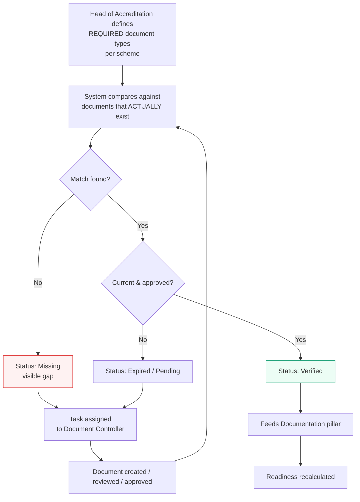
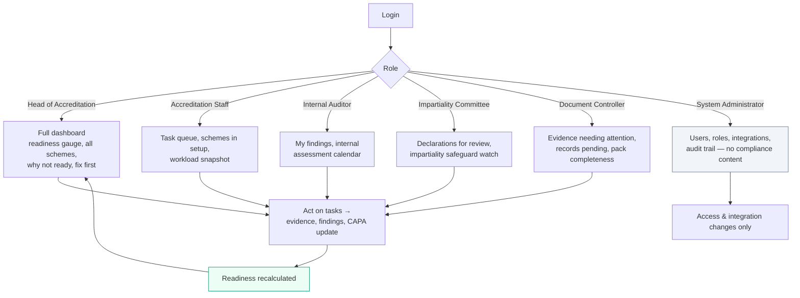

# Business Process Documentation — NexAccred

**Version:** 1.0

This document describes the operating processes NexAccred supports, who owns each step, and where the boundary with Platform Audit and AIHCM sits.

---

## 0. System Boundary

```mermaid
flowchart LR
    subgraph PA["PLATFORM AUDIT — system of record<br/>(not yet built — stub adapter today)"]
        direction TB
        PA1["Application Review"]
        PA2["Audit Scheduling"]
        PA3["Audit Execution"]
        PA4["Technical Review"]
        PA5["Certificate Issuance"]
    end

    subgraph HCM["AIHCM — system of record<br/>(real, running sibling app)"]
        direction TB
        HCM1["Employee Identity"]
        HCM2["Competency &amp; Skills"]
    end

    subgraph NX["NEXACCRED — readiness engine"]
        direction TB
        NX1["Requirement &amp; Scheme Config"]
        NX2["Evidence &amp; Compliance"]
        NX3["Readiness Computation"]
        NX4["Assessment &amp; Witness"]
        NX5["Findings / CAPA / Risk"]
        NX6["Tasks"]
        NX7["Auditor Authorization<br/>(scope + expiry, NexAccred-owned)"]
    end

    PA -->|"read-only sync<br/>4 domains"| NX
    HCM -->|"read-only sync<br/>REST + JWT"| NX
    NX -.->|"never writes back"| PA
    NX -.->|"never writes back"| HCM

    style PA fill:#EFF6FF,stroke:#2563EB
    style HCM fill:#ECFDF5,stroke:#059669
    style NX fill:#F5F1FE,stroke:#7C3AED
```

**Rule:** NexAccred never duplicates or writes to Platform Audit or AIHCM. Operational execution and personnel/competency data stay there; readiness judgement — including CAB-specific auditor authorization and its expiry — happens here.

---

## BP-1 — Onboarding a New Accreditation Scheme

**Owner:** Head of Accreditation
**Trigger:** CAB decides to pursue accreditation for a new scheme
**Critical property:** completes with **zero developer involvement**

**Why two steps?** Registering creates a real, visible Draft record immediately. Dropping someone into a 10-step wizard with nothing saved is how configuration gets abandoned halfway with no trace.

---

## BP-2 — Continuous Readiness Monitoring

**Owner:** Head of Accreditation (monitors), all roles (feed)
**Trigger:** continuous — every page load recalculates
**Frequency:** real-time

**Key property:** a blocking rule can only push a band **down**. A 90% weighted score with an open critical gap reads *Ready with Risks*, never *Ready*.

---

## BP-3 — Preparing for an Accreditation Body Assessment

**Owner:** Head of Accreditation
**Trigger:** scheduled AB visit approaching (45 / 30 / 14 / 7-day notifications)

**Note on the Evidence Pack:** an internal preparation and navigation tool. It does *not* automatically expose confidential documents — it indexes what exists per requirement so the team can navigate quickly during the visit.

---

## BP-4 — Finding → CAPA → Closure

**Owner:** finding owner (execution), Head of Accreditation (approval)
**Trigger:** finding raised from any source

**Finding sources:** Internal Audit · AB Assessment · Witness Assessment · Complaint · Appeal · Impartiality Review · Management Review · Internal Monitoring

Every finding links to requirement, scheme, assessment, evidence, and CAPA — so closing it demonstrably moves the readiness score.

---

## BP-5 — Witness Audit Cycle

**Owner:** Head of Accreditation
**Trigger:** accreditation cycle begins, or AB requires additional witnessing

Witness audits are a common cause of surprise findings because they are tracked informally. Modelling them as a cycle with an explicit outstanding count makes the obligation visible before it becomes a problem.

---

## BP-6 — Requirement Change Management

**Owner:** Head of Accreditation
**Trigger:** standard revised, IAF document updated, or AB issues a new rule

**Why this matters:** without impact analysis, a standard revision means re-reading the entire standard. With it, the team gets a scoped action list.

---

## BP-7 — Document Control

**Owner:** Document Controller

The separation between "what should exist" and "what does exist" is the entire point. A library that only lists what you have can never tell you what you're missing.

---

## BP-8 — Role-Based Daily Operation

Every operational role feeds the readiness loop. System Administrator sits deliberately outside it.

---

## Process Ownership Summary

| Process | Owner | Contributors | Consumes from Platform Audit | Consumes from AIHCM |
|---|---|---|---|---|
| BP-1 Scheme onboarding | Head of Accreditation | Accreditation Staff | — | Competence criteria |
| BP-2 Readiness monitoring | Head of Accreditation | All operational roles | Operations pillar | Competence pillar |
| BP-3 Assessment preparation | Head of Accreditation | Doc Controller, Staff | Audit execution records | — |
| BP-4 Finding → CAPA | Finding owner | Internal Auditor, Head of Accreditation | Audit findings | — |
| BP-5 Witness cycle | Head of Accreditation | Certification Manager | Audit schedule | Auditor identity |
| BP-6 Requirement change | Head of Accreditation | Technical Manager | — | — |
| BP-7 Document control | Document Controller | Head of Accreditation | — | — |
| BP-8 Daily operation | All roles | — | Workload | Competency |
